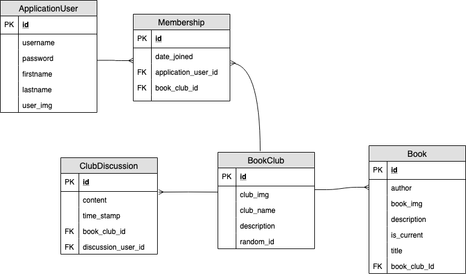

# Omnibus

Omnibus is a full stack CRUD book club application. Users can join a book club, create a book club, add a book to the club, and see other members of the club.

---

## Table of Contents

[Introduction](#introduction)<br />
[Vision](#vision)<br />
[Scope](#scope)<br />
[MVP](#mvp)<br />
[Stretch Goals](#stretch-goals)<br />
[Dependencies](#dependencies)<br />
[Build](#build)<br />
[Database Schema](#database-schema)<br />
[Route Endpoints](#route-endpoints)<br />
[Work Schema](#work-flow)<br />
[Team Members](#team-members)<br />
[Acknowledgements](#acknowledgements)<br />

---

## Introduction

As Developers, we wanted to create an application where users can sign up, create a Book Club and share it with their friends.  

[Table of Contents](#table-of-contents)<br />

---

## Vision
The Omnibus backend will host all the endpoints that will do the following:

- create and read a book club
- create, read, and delete a book from a club
- create and read members of a club 

[Table of Contents](#table-of-contents)<br />

---

## Scope
_IN_ - the Omnibus backend will

- provide a registration feature for users to create an account
- provide a login feature for returning users to sign back in
- provide a feature for a user to join a book club
- provide a feature for a user to add a book club
- provide a feature for a user to add or remove a book from a book club
- display a list of the clubs
- display all the members of a club
- display a list of current and previous books in each club

_OUT_ - the Omnibus will not

- allow CRUD operations for users who are not logged in
- allow a user, who is not part of the club, to add or remove books  

[Table of Contents](#table-of-contents)<br />

---

## MVP
Users will be able to register for an account and sign in. They can view clubs that they've joined, see who is in those clubs and see what they're reading. If they'd like, they can create a club and they can add a book to that club. They can send their friends a specific club ID, and their friends can join the same club.  

[Table of Contents](#table-of-contents)<br />

---

## Stretch Goals
- [ ] As a developer, I want to connect with the Google Books API to pull book data easily and ensure accurate information 
- [x] As a user, I want to be able to post in a group discussion board about the book we are reading
- [x] As a user, I can update my account profile image
- [ ] As a user, I want to display how many books I’ve read in all my book clubs on my profile so that I can show off to my friends
- [x] As a user, I should be able to view a list of previous books my club has finished  

[Table of Contents](#table-of-contents)<br />

---

## Dependencies
Omnibus is a gradle Java application that utilizes a postgresql database and is hosted on AWS Elastic Beanstalk. If you're looking to run this on your machine, ensure that [postgresql](https://www.postgresql.org) is downloaded on your machine.  

[Table of Contents](#table-of-contents)<br />

---

## Build
Clone this repo to a directory of your choice and open with your favorite editor. Before building and running in your editor, add a file called application.properties to your resources folder.  It needs to have the correct information such as:

```
spring.datasource.url=jdbc:postgresql://localhost:5432/PickANameForTheDB
spring.datasource.username=YourPostgresqlUsername
spring.datasource.password=YourPostgresqlPassword
spring.jpa.hibernate.ddl-auto=create
```

Note that:

```
spring.jpa.hibernate.ddl-auto=create
```

can be changed to

```
spring.jpa.hibernate.ddl-auto=update
```

if you're looking to do some work, but don't want to drop and create the tables every time the application is run.  

[Table of Contents](#table-of-contents)<br />

---

## Database Schema



---

## Route endpoints

When running this application locally, navigate to localhost:8080 with the following endpoints:

```
/
```

This is the splash page with an option to either log in or sign up for an account.

---

```
/signup
```

This is where a user can register for an account with Omnibus.

---

```
/login
```

This is where a user can log in with their credentials.

---

```
/logout
```

This is where a user can log out of Omnibus.

---

```
/clubs/{randomId}
```

This will take a user to a specific club profile where they can see the list of members and books.


---

```
/myprofile
```

This allows a user to see their profile.

---

```
/users/{id}
```

This allows a user to see other users' profile.  

[Table of Contents](#table-of-contents)<br />

---

## Work Flow
Our team utilized an agile process. User stories were written and assigned to team members who wanted to complete them. Each branch is a feature and was for a specific user story. When a feature was completed and pushed, someone who did not write the code reviewed it and merged the pull request. Features were first merged to the dev branch. Once everything was working and up to our satisfaction, dev was then merged into master.  

[Table of Contents](#table-of-contents)<br />

---

## User Stories
- As a user, I should be able to create a new account   
Time Estimate: by the end of Day 1 (4-6 hours)
- As a user, I should be able to login with newly created credentials and log out  
Time Estimate: by the end of Day 1 (0.5 hour)
- As a user, I should be able to create a new book club.  
Time Estimate: by the end of Day 2 (3-4 hours)
- As a user, I should be able to share access to newly created book club  
Time Estimate: by the end of Day 2 (1 hour)
- As a user, I should be able to add a current book to the book club  
Time Estimate: by the end of Day 2 (3 hours)
- As a developer, I want my website to require a login  
Time Estimate: by the end of Day 3 (1 hour)
- As a developer, I want to store passwords securely (not in plain text)  
Time Estimate: by the end of Day 1 (0.25 hour)
- As a developer, I want to make sure that book clubs have a unique code (randomly generated)  
Time Estimate: by the end of Day 2 (1 hour)
- As a developer, I want to know which users and which books are in a book club  
Time Estimate: by the end of Day 3 (2 hours)  

[Table of Contents](#table-of-contents)<br />

---

## Challenges
Some of the challenges we faced were creating the proper relationship between our tables and implementing some of our stretch goals. Once we fully understood the relationships we wanted to create, everything went pretty smoothly. Testing also became slightly complex, but nothing unmanagable. 

[Table of Contents](#table-of-contents)<br />

---

## Wins
- Prepping on Friday to set us up on Tuesday due to the bank holiday
- Completion of MVP by Wednesday
- Successful Deployment
- Our Team <3  

[Table of Contents](#table-of-contents)<br />

---

## Team Members
[MarishaHoza](https://github.com/MarishaHoza)  
[perezm27](https://github.com/perezm27)  
[Bomi Bear](https://github.com/bomibear)  
[trevorjdobson](https://github.com/trevorjdobson)  

[Table of Contents](#table-of-contents)<br />

---

## [Deployed Site](http://omnibus2-env.ahat3y67sm.us-east-1.elasticbeanstalk.com/)  

[Table of Contents](#table-of-contents)<br />

---

## Acknowledgements
Style was implemented with [Bootstrap](https://getbootstrap.com/).
Generating the random string that comes after the club name is from [here](https://www.baeldung.com/java-random-string)  

[Table of Contents](#table-of-contents)<br />
